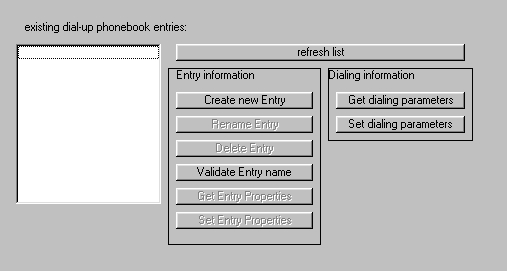

<div align="center">

## DUN\- Dial up networking


</div>

### Description

using advanced dial-up networking functionality in your projects.
 
### More Info
 
see the various functions for details. It's explained there quite well.

There are several tecniques used in the code, like callback functions or asyncronous calls.

No side effects encountered until now. It was tested on Win98SE, Win2kProfessional and WIndows XP Pro


<span>             |<span>
---                |---
**Submitted On**   |2002-10-16 18:26:22
**By**             |[Andreas Schubert](https://github.com/Planet-Source-Code/PSCIndex/blob/master/ByAuthor/andreas-schubert.md)
**Level**          |Intermediate
**User Rating**    |4.8 (24 globes from 5 users)
**Compatibility**  |VB 3\.0, VB 4\.0 \(16\-bit\), VB 4\.0 \(32\-bit\), VB 5\.0, VB 6\.0, VB Script, ASP \(Active Server Pages\) , VBA MS Access
**Category**       |[Windows API Call/ Explanation](https://github.com/Planet-Source-Code/PSCIndex/blob/master/ByCategory/windows-api-call-explanation__1-39.md)
**World**          |[Visual Basic](https://github.com/Planet-Source-Code/PSCIndex/blob/master/ByWorld/visual-basic.md)
**Archive File**   |[DUN\-\_Dial\_14795310182002\.zip](https://github.com/Planet-Source-Code/andreas-schubert-dun-dial-up-networking__1-39933/archive/master.zip)

### API Declarations

```
Ever tried to integrate dial-up networking into your project?
I'm speaking of creating, altering or deleting entries as well as altering properties,
enumerating connections or dialing syncronous or asyncronous.
Projection results can be retrieved also!
Well, it is not so easy and good samples are hard to find.
So I sat down and did the job of translating all the data structures
from C++ to VB.
For easy use I combined all into a little module for you.
If you find this useful, please vote. It took me quite some time to finish this.
```


